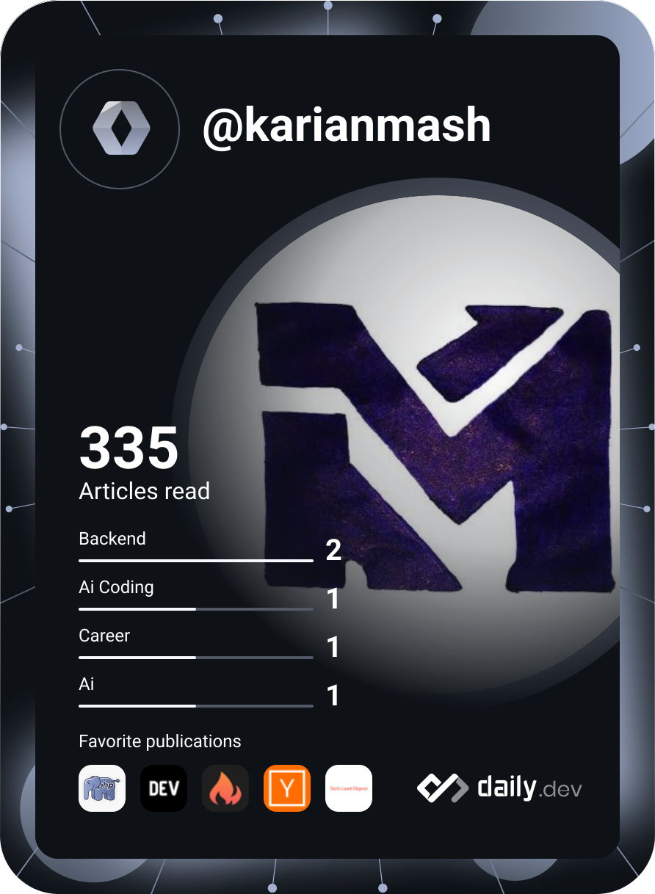

  

<h1 align="center">Hi there 👋, I'm Ian Macharia</h1>

  <b>Senior Software Engineer & Full-stack Architect | Tech Lead | AI Enthusiast</b> 
  <i>Engineering scalable web solutions and intelligent agentic workflows.</i>

  
  
  
  

  
  
  
  

---

### 👨‍💻 About Me

I am a **Senior Software Engineer & Full-stack Architect** with **5+ years of experience** building high-performance, enterprise-grade applications. Currently at **Griffin Global Technologies**, I drive the full-stack development of complex systems using **ASP.NET Core**, **React.js** / **Next.js**, **MSSQL / PostgreSQL**, `cloud-native architectures` (**AWS** & **Microsoft Azure**) and collaborate with distributed engineering teams across Kenya, Ethiopia, and the USA.

Previously a **Tech Lead** at **Pesira Technologies Limited**, I specialized in designing scalable software solutions using **Spring Boot**, **React.js** / **Next.js**, **PostgreSQL**, and **GCP**, optimizing database performance, and driving developer experience (DevEx) through automation and CI/CD pipelines.

Beyond traditional full-stack engineering, I am deeply focused on the intersection of **Software Engineering and Artificial Intelligence**—integrating LLMs, building autonomous AI agents, and designing production-ready RAG (Retrieval-Augmented Generation) pipelines.

- 🚀 **Currently Architecting:** Full-stack enterprise applications using **ASP.NET Core, React.js / Next.js, PostgreSQL / MSSQL, and AWS/GCP/Cloudflare**.
- 🤖 **AI & Agentic Systems:** LLM integration, autonomous agents, RAG workflows, and vector search embeddings.
- 🧠 **Architecture & Optimization:** Complex relational schema design, EF Core query tuning, caching strategies with Redis, and microservices.
- 💬 **Ask Me About:** ASP.NET Core, Next.js / TanStack Start architecture, database keyset pagination, and engineering team leadership.
- 📝 **Writing & Insights:** I write in-depth technical guides on backend engineering, system design, and modern web frameworks on my **[Blog](https://ianmacharia.dev/blog)**.

---

### ✍️ Featured Articles & Deep Dives

<table width="100%">
  <tr>
    <td width="50%" valign="top">
      
       
      
      
      <h4><a href="https://ianmacharia.dev/blog/everyday-mssql-patterns-for-backend-engineers">Everyday Microsoft SQL Server Patterns for Backend Engineers</a></h4>
      
<i>Safe upserts without MERGE, chunked batch deletes, keyset pagination, timezone conversions, and indexing patterns.</i>

      <a href="https://ianmacharia.dev/blog/everyday-mssql-patterns-for-backend-engineers"><b>Read Article →</b></a>
    </td>
    <td width="50%" valign="top">
      
       
      
      
      <h4><a href="https://ianmacharia.dev/blog/cloudflare-developer-ecosystem-guide">The Cloudflare Developer Ecosystem: Full-Stack Edge Systems</a></h4>
      
<i>Architect's guide to building resilient edge systems using Workers, Pages, Durable Objects, D1, Hyperdrive, R2, and Workers AI.</i>

      <a href="https://ianmacharia.dev/blog/cloudflare-developer-ecosystem-guide"><b>Read Article →</b></a>
    </td>
  </tr>
  <tr>
    <td width="50%" valign="top">
      
       
      
      
      <h4><a href="https://ianmacharia.dev/blog/postgre-sql-is-no-longer-just-a-database">PostgreSQL Is No Longer Just a Database</a></h4>
      
<i>How PostgreSQL evolved into the backbone of modern architectures—JSON document stores, full-text search, and AI vector embeddings.</i>

      <a href="https://ianmacharia.dev/blog/postgre-sql-is-no-longer-just-a-database"><b>Read Article →</b></a>
    </td>
    <td width="50%" valign="top">
      
       
      
      
      <h4><a href="https://ianmacharia.dev/blog/ef-core-performance-mistakes-that-quietly-destroy-production-apis">EF Core Mistakes That Quietly Destroy Production APIs</a></h4>
      
<i>Under-the-hood analysis of LINQ translation, entity tracking overhead, N+1 query traps, Cartesian joins, and memory leaks.</i>

      <a href="https://ianmacharia.dev/blog/ef-core-performance-mistakes-that-quietly-destroy-production-apis"><b>Read Article →</b></a>
    </td>
  </tr>
</table>

---

### 🛠️ Tech Stack & Ecosystem

<table width="100%">
  <tr>
    <th align="left">💻 Frontend & Web</th>
  </tr>
  <tr>
    <td>
      
      
      
      
      
      
      
      
      
      
    </td>
  </tr>
  <tr>
    <th align="left">⚙️ Backend & APIs</th>
  </tr>
  <tr>
    <td>
      
      
      
      
      
      
      
      
      
      
    </td>
  </tr>
  <tr>
    <th align="left">🤖 AI & LLMs</th>
  </tr>
  <tr>
    <td>
      
      
      
      
      
      
    </td>
  </tr>
  <tr>
    <th align="left">🗄️ Databases & Caching</th>
  </tr>
  <tr>
    <td>
      
      
      
      
      
    </td>
  </tr>
  <tr>
    <th align="left">☁️ Cloud, DevOps & Tools</th>
  </tr>
  <tr>
    <td>
      
      
      
      
      
      
      
      
      
      
    </td>
  </tr>
</table>

---

### 📜 Certifications & Education

- ☁️ **[Google Cloud Core Services](https://www.linkedin.com/learning/certificates/a5ec255abff63272ff53f69aec9d976547bea0b362043d61bd01d34b2b314c32/)** — LinkedIn Learning *(Issued May 2024)*
- ☁️ **[Ultimate AWS Certified Cloud Practitioner (CLF-C02)](https://drive.google.com/file/d/16Yos5hJQxxcT-BcEyJGRNuGXA3fwzic8/view)** — Udemy *(Issued Oct 2023)*
- 💻 **[Software Development Training Program](https://drive.google.com/file/d/1tsU6WrvlA5alxjkGreXKiYyLliLPZ0qI/view)** — The Jitu *(Issued Oct 2022)*
- 🎓 **Bachelor of Science in Computer Science** — Kirinyaga University *(Aug 2018 – Oct 2022)*

---

### 📊 GitHub Engineering Statistics

<table align="center" width="100%">
  <tr>
    <td width="50%" align="center">
      
    </td>
    <td width="50%" align="center">
      
    </td>
  </tr>
  <tr>
    <td colspan="2" align="center">
      
    </td>
  </tr>
</table>

---

### 📈 Activity & Community

  

  

---

### ✉️ Let's Connect!

  
  
  
  
  

  Designed & Developed with ❤️ by <a href="https://ianmacharia.dev/">Ian Macharia</a>

